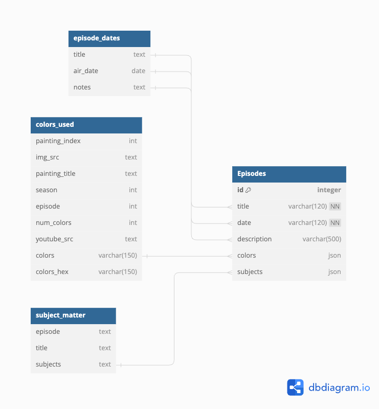

# Happy Little API

The Happy Little API is a Flask-based web application that serves as a RESTful API for accessing and querying a database of episodes from the popular TV show "The Joy of Painting" hosted by Bob Ross.

## Features

- **Episode Retrieval**: The API provides endpoints to retrieve all episodes, a single episode by ID, and a list of all episode titles.
- **Filtering by Color**: Users can retrieve episodes that use a specific color in their paintings.
- **Filtering by Subject Matter**: Users can retrieve episodes that cover a specific subject matter.
- **Filtering by Month**: Users can retrieve episodes that aired in a specific month.
- **Filtering by Multiple Criteria**: Users can filter episodes by a combination of color, subject matter, and month.
- **Exact Matching**: Users can retrieve episodes that have an exact match for the specified colors and/or subjects.

## API Endpoints

The following API endpoints are available:

- `GET /episodes`: Retrieves all episodes.
- `GET /episodes/<int:id>`: Retrieves a single episode by ID.
- `GET /episodes/names`: Retrieves a list of all episode titles.
- `GET /colors/<color>`: Retrieves episodes that use a specific color.
- `GET /subjects/<subject>`: Retrieves episodes that cover a specific subject matter.
- `GET /episodes/month/<month>`: Retrieves episodes that aired in a specific month.
- `GET /episodes/month/<month>/colors/<color>`: Retrieves episodes that aired in a specific month and used a specific color.
- `GET /episodes/month/<month>/subjects/<subject>`: Retrieves episodes that aired in a specific month and covered a specific subject matter.
- `GET /episodes/month/<month>/subjects/<subject>/colors/<color>`: Retrieves episodes that aired in a specific month, covered a specific subject matter, and used a specific color.
- `GET /episodes/<title>`: Retrieves episodes with a specific title.
- `GET /colors/<path:colors>`: Retrieves episodes that use any of the specified colors.
- `GET /subjects/<path:subjects>`: Retrieves episodes that cover any of the specified subjects.
- `GET /colors/<path:colors>/subjects/<path:subjects>`: Retrieves episodes that use any of the specified colors and cover any of the specified subjects.
- `GET /colors/exactly/<path:colors>`: Retrieves episodes that use exactly the specified colors.
- `GET /subjects/exactly/<path:subjects>`: Retrieves episodes that cover exactly the specified subjects.
- `GET /colors/exactly/<path:colors>/subjects/exactly/<path:subjects>`: Retrieves episodes that use exactly the specified colors and cover exactly the specified subjects.

## Database Schema



The application uses a SQLAlchemy-based database model with the following schema:

- `Episodes` table:
  - `id`: Unique identifier for the episode
  - `title`: Title of the episode
  - `date`: Date the episode aired
  - `description`: Description or notes about the episode if there are any
  - `colors`: JSON-encoded list of colors used in the episode
  - `subjects`: JSON-encoded list of subject matters covered in the episode

## Installation and Setup

1. Clone the repository:
   ```
   git clone https://github.com/your-username/happy-little-api.git
   ```
2. Install the required dependencies:
   ```
   cd happy-little-api
   pip install -r requirements.txt
   ```
3. Set up the database:
   ```
   python app.py
   ```
   This will create the necessary tables and load the data into the database.
4. Run the application:
   ```
   python app.py
   ```
   The API will be available at `http://localhost:5000`.

## Usage

You can use the API by making HTTP requests to the available endpoints. For example, to retrieve all episodes, you can use the following curl command:

```
curl http://localhost:5000/episodes
```

To retrieve episodes that used the color "Prussian Blue", you can use:

```
curl http://localhost:5000/colors/Prussian%20Blue
```

Explore the available endpoints and their documentation to interact with the Happy Little API.
